# Quick References: Focus Feed 홈 — 깔끔·산뜻 발견 피드 + 라디오

## TL;DR
끌리는 인디 제품들은 **"잡음 없는 소스 피드(흰 배경·작은 카드) + 원클릭 Play All 라디오"** 두 축으로 수렴한다 — `sort.to`("distraction-free reader, add your favorite sources")가 Focus Feed의 포지셔닝과 사실상 동일하고, `NYT Listen`의 "Today's Stories + Play All"이 Scan→Pick→Play 흐름을 그대로 보여준다.

## Patterns (먼저 답)

세 패턴이 반복된다:

1. **깔끔한 소스 피드** — 흰/단색 배경, 카드 1줄(작은 소스 아바타 + 제목 + 메타), 잡음 0. 그리드(유튜브) 아니라 **세로 리스트**. 정렬 토글(최신순/추천순)·카테고리 탭은 상단 한 줄로. → `sort`, `substack`, `financial-times`, `matter`, `readwise-reader`
2. **Play All 라디오 + 큐 + 미니플레이어** — 상단 큰 [▶ Play All] 한 번으로 스트림 시작, 하단 고정 미니플레이어, 별도 Queue 탭. → `nyt-audio`, `neuecast`, `apple-music`, `overcast`
3. **마찰 0 캡처** — 확장/북마클릿으로 "지금 이거 저장". → `instapaper`

핵심 takeaway: **유튜브를 닮지 마라.** 끌리는 앱들은 그리드·무한스크롤·썸네일 폭격이 아니라 *여백·세로 리스트·작은 단위·한 번의 큰 액션(Play All)*으로 차분함을 만든다. 이게 네가 말한 "가볍고 산뜻".

---

## References

### Pattern A: 깔끔한 소스 피드 (Focus Feed 홈의 척추)

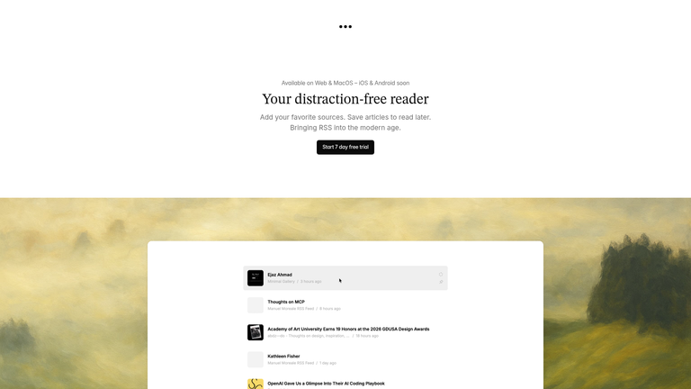
*sort.to — "Your distraction-free reader. Add your favorite sources. Save articles to read later. Bringing RSS into the modern age." 흰 배경 + 작은 소스 아바타 카드 세로 리스트. **Focus Feed 포지셔닝과 거의 동일.** [Web]*

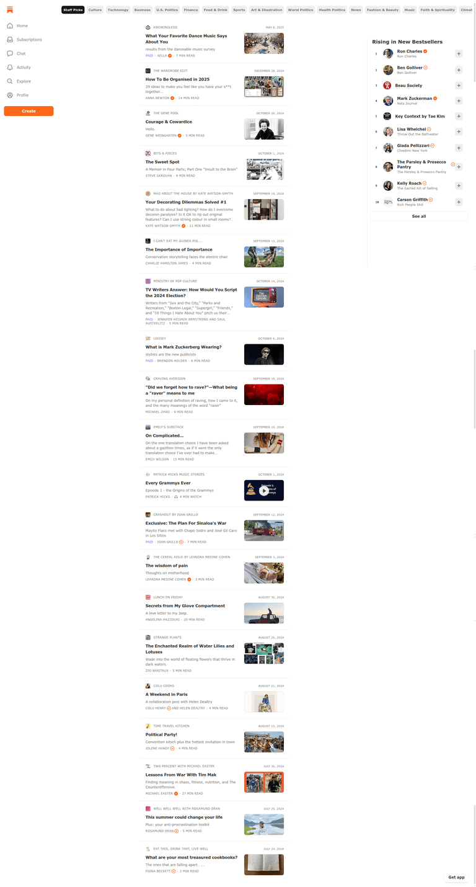
*Substack browse — 추천 포스트 세로 피드(제목·작성자·썸네일·날짜·읽는시간) + 상단 카테고리 탭 + 사이드 "Rising" 랭킹. 발견 피드의 정석. [Lazyweb]*

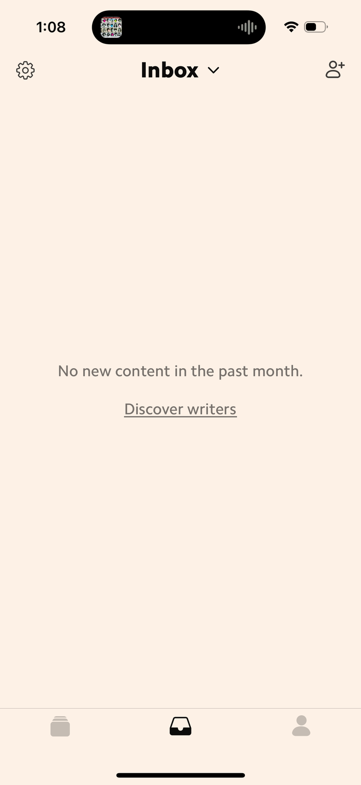
*Matter — 뉴스레터 인박스 피드. 발행처 로고 + 헤드라인 + 미리보기 스니펫 + 받은시간·단어수. 차분한 "받은 것 훑기" 미감(highDesignBar). [Lazyweb]*

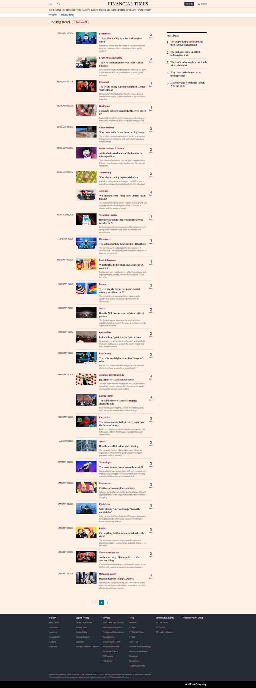
*FT The Big Read — 썸네일+카테고리라벨+날짜+헤드라인 세로 피드, 각 항목에 북마크/저장 + 섹션 "Add to myFT" 팔로우. 저장·팔로우 액션 배치 참고. [Lazyweb]*

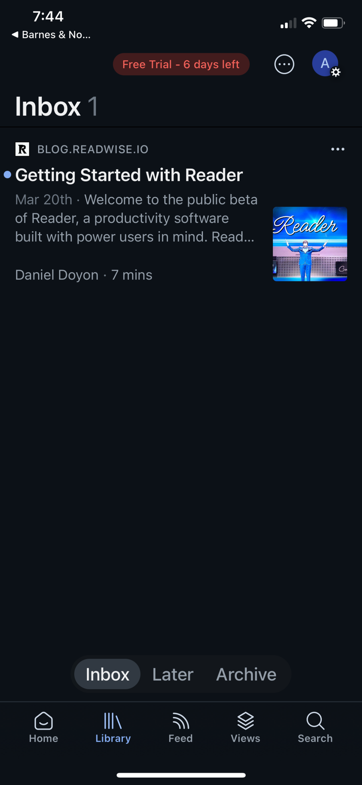
*Readwise Reader — "Daily Digest" 피드 안의 글 상세(출처·작성자·읽는시간·발행일) + 저장/숏리스트/태그. 깊이 있는 콘텐츠를 다루는 미감. [Lazyweb]*

이들 공통점: **세로 리스트 + 작은 카드 + 여백 + 저장/팔로우 액션이 카드에 붙음.** 그리드 없음.

### Pattern B: Play All 라디오 + 큐 + 미니플레이어 (좌측 모니터용)

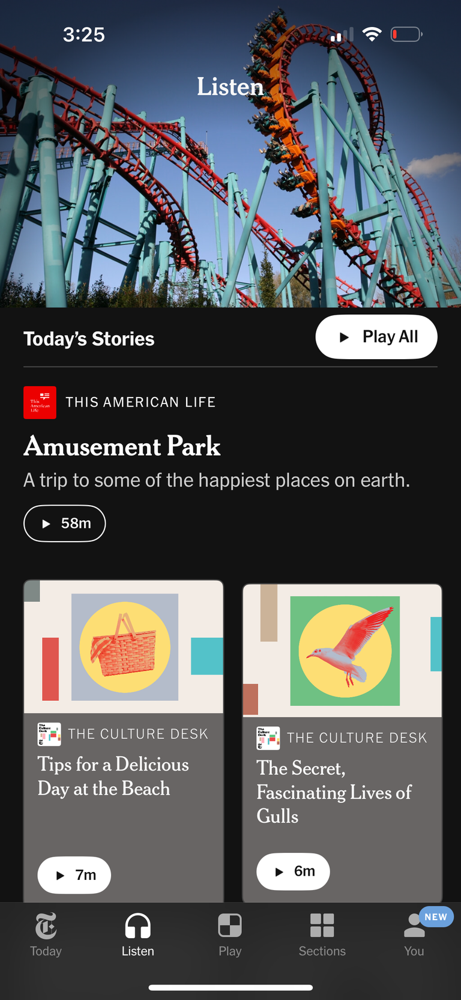
*NYT Listen — "Today's Stories" 헤더 옆 **[▶ Play All]** 버튼, 히어로 카드(제목·58m) + 2단 스토리 카드(각 ▶·시간), 하단 탭 Today/Listen/Play/Sections/You. **Scan→Pick→Play 그대로.** [Lazyweb]*

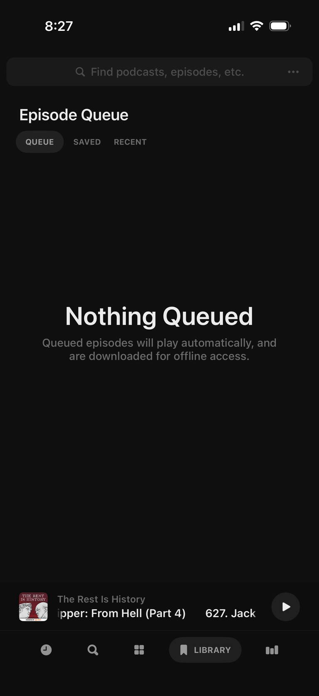
*Neuecast — Episode Queue (탭: Queue/Saved/Recent) + 하단 고정 미니플레이어. "다음 큐" UI 참고. [Lazyweb]*

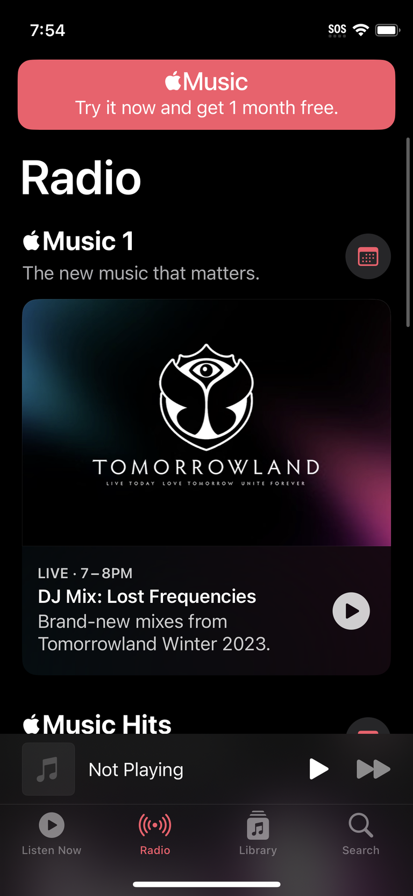
*Apple Music 라디오 — 큰 프로모 카드 + ▶ + 하단 미니플레이어 바. "지금 틀기" 큰 액션. [Lazyweb]*

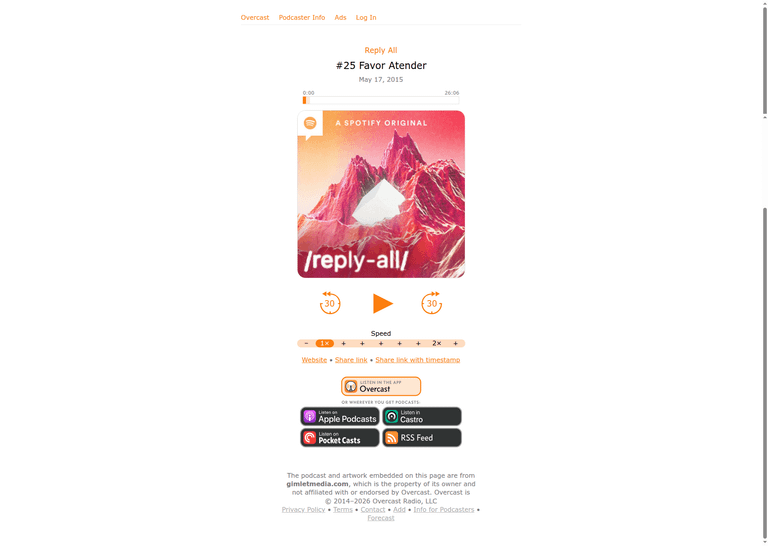
*Overcast — 군더더기 없는 재생 페이지(제목·타임라인·속도·30초 스킵). 미니멀 플레이어 미감. [Web]*

공통점: **상단 큰 Play All 1개 + 하단 고정 미니플레이어 + 별도 Queue.** 라디오 모드의 표준.

### Pattern C: 마찰 0 캡처

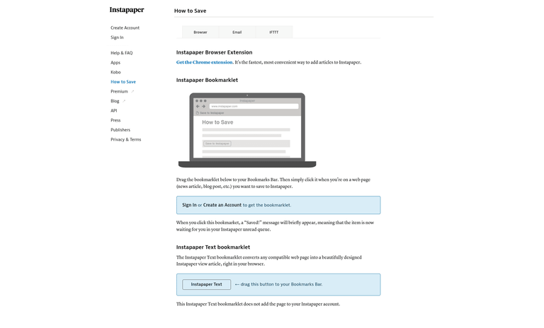
*Instapaper — Browser/Email/IFTTT 탭으로 저장 방법 안내, **크롬 확장 + 북마클릿 드래그**로 read-later 저장. 채널 캡처(확장/북마클릿)의 정석. [Lazyweb]*

---

# v2 추가 — 영상형 발견 + 숏폼/롱폼 + 라디오 플레이어바

### Pattern D: 영상형 발견 (큰 썸네일 피드)

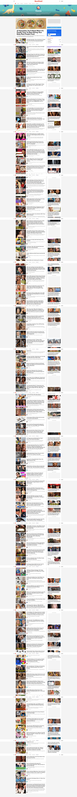
*BuzzFeed — 추천 영상 세로 피드(썸네일+제목+채널+조회수+시간) + 우측 추천 칼럼. **유튜브보다 정돈된 영상 피드.** [Lazyweb]*

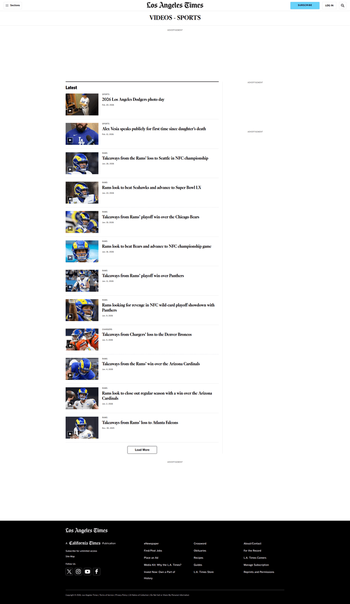
*LA Times Video — 영상 스토리 세로 피드(썸네일+카테고리 라벨+헤드라인+날짜). 에디토리얼 톤, 깔끔. [Lazyweb]*

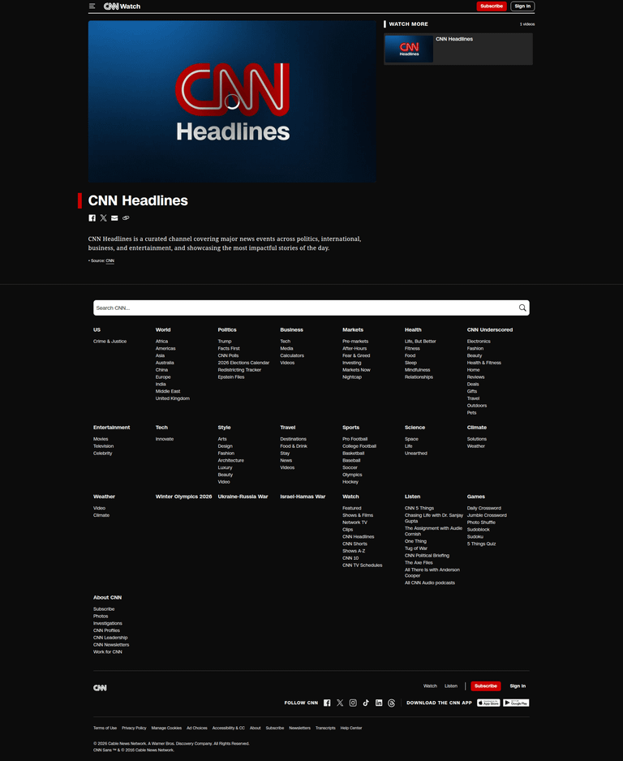
*CNN Video — 큰 히어로 썸네일 + ▶ + "Watch more" 사이드. 끌리는 1개를 크게. [Lazyweb]*

→ 롱폼 = 세로 리스트지만 **썸네일을 더 크게**. (sort.to의 깔끔함 + 큰 썸네일)

### Pattern E: 숏폼/롱폼 공존

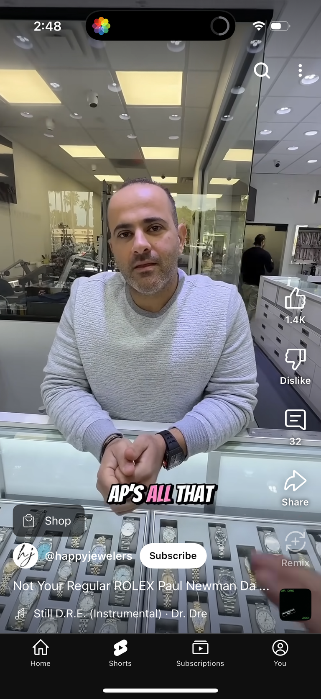
*YouTube Shorts — 풀스크린 세로 숏폼(좋아요/댓글/공유/구독 + 하단 탭 Home/Shorts/Subs). 네가 폰에서 보는 그것. [Lazyweb]*

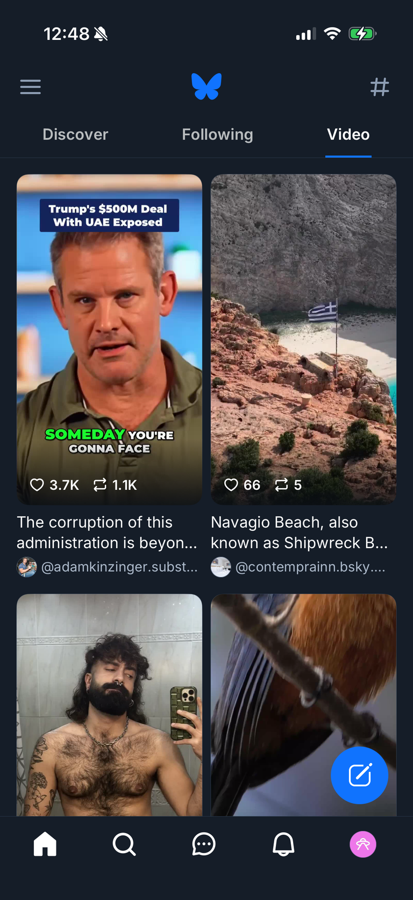
*Bluesky Video 탭 — ⭐ **숏폼을 2단 그리드**로(썸네일+제목+핸들+♡). 풀스크린 스와이프 강제 안 함 = 깔끔. [Lazyweb]*

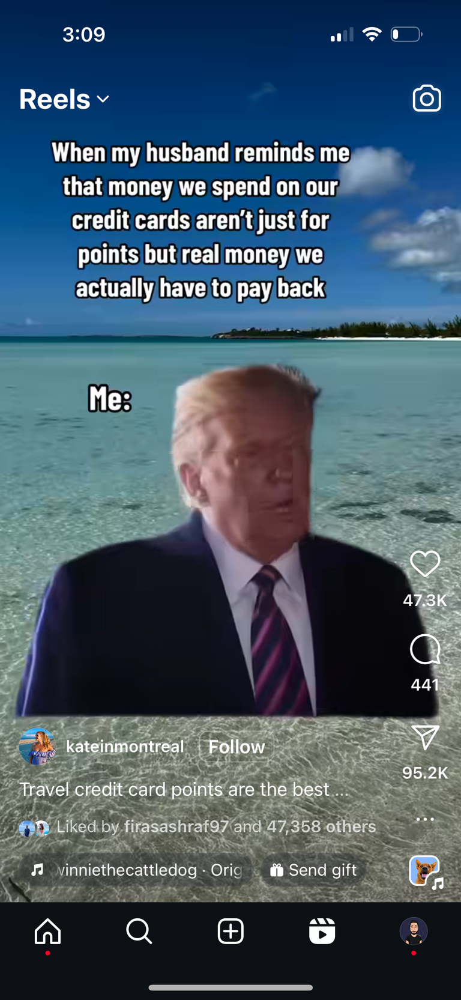
*Instagram Reels — 풀스크린 숏폼 표준(우측 액션 스택). 전용 숏폼 뷰가 필요할 때 참고. [Lazyweb]*

→ 제안: **롱폼=세로 리스트, 숏폼=별도 그리드 행/탭**(Bluesky형). 한 피드에 섞어 폭격 ❌. 풀스크린 스와이프는 *원할 때만* 들어가는 전용 모드로.

### Pattern F: 라디오 플레이어바 (깔끔 + 끌리게)

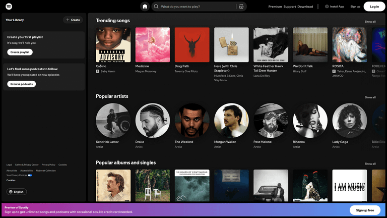
*Spotify 데스크톱 — 좌측 사이드바 + 메인 캐러셀 + (하단 고정 플레이어바). 데스크톱 셸 표준. [Lazyweb]*

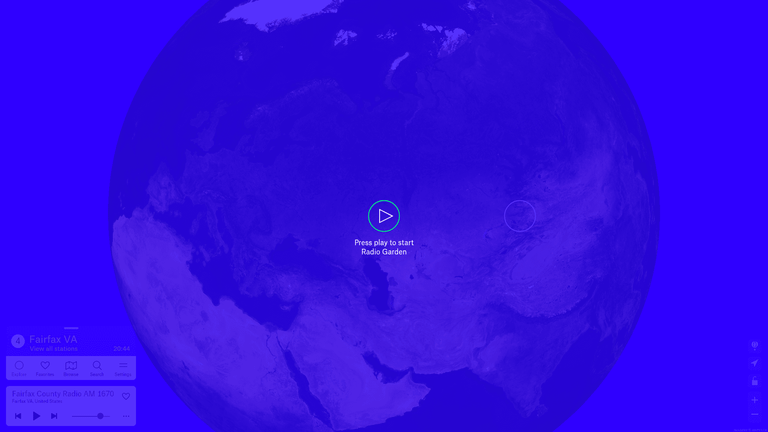
*Radio Garden — ⭐ 큰 [▶] 한 번에 재생 시작 + 미니플레이어. "press play" = 0클릭 라디오. [Lazyweb]*

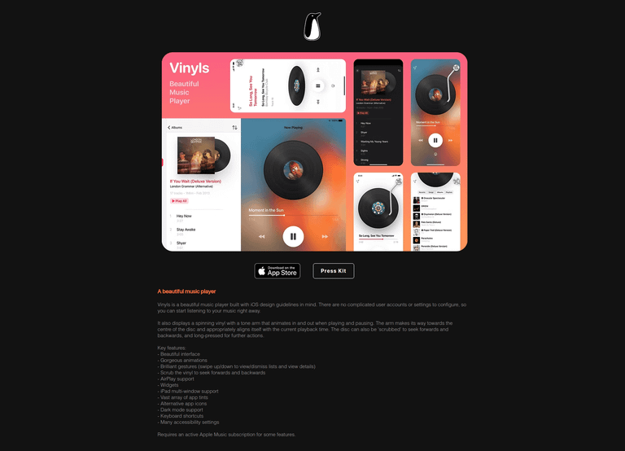
*Vinyls — 회전 비닐 애니 now-playing + 스크럽. **끌리는/감각적 플레이어 미감.** [Lazyweb]*

→ FF 플레이어바: **하단 고정 + "전체 틀기"로 채움 + vinyls급 감각.** 큐는 neuecast/apple-music 하단 미니바 형태.

---

## Focus Feed 홈에 적용 (데스크톱 90% 기준)

> 네 피드백 반영: "오늘의 브리핑" 같은 프레이밍 ❌ → **그냥 깔끔한 피드**. 기본 최신순 + 추천순 토글. sort.to 미감 + NYT의 Play All.

```
┌──────────────────────────────────────────────────────────┐
│  Focus Feed        [최신순 ▾ | 추천순]   [＋ 채널]   [🔍]  │  ← 정렬 토글 + 캡처
│                                          [ ▶ 전체 틀기 ]   │  ← Play All (라디오)
├──────────────────────────────────────────────────────────┤
│  ── 숏폼 (오늘) ──────────────────────────  더보기 →       │
│  ┌─────┐ ┌─────┐ ┌─────┐ ┌─────┐   ← 가로 스크롤 그리드   │
│  │  ▷  │ │  ▷  │ │  ▷  │ │  ▷  │      (Bluesky형,          │
│  └─────┘ └─────┘ └─────┘ └─────┘       스와이프 강제 X)    │
├──────────────────────────────────────────────────────────┤
│  ── 롱폼 ─────────────────────────────────────             │
│  ┌────────────┐  조코딩 · 2시간 전              [▶] [⤓]    │
│  │  큰 썸네일  │  GPT-5.4 로 풀스택 앱 만들기               │  ← 큰 썸네일 세로 리스트
│  └────────────┘  · AI 후크 1줄 (왜 너 취향인지)            │     (CNN·sort.to 혼합)
│  ┌────────────┐  Fireship · 5시간 전            [▶] [⤓]    │
│  │  큰 썸네일  │  Next.js 16 의 숨은 기능 7가지             │
│  └────────────┘                                            │
│  ┌────────────┐  Karpathy · 어제                [▶] [⤓]    │
│  │  큰 썸네일  │  LLM 에이전트 깊게 파보기 (deep dive)      │  ← 깊이/인사이트 강조
│  └────────────┘                                            │
│              · · ·  오늘치 끝. 일하러 가셈 ✓  · · ·         │  ← 유한 (안티 무한스크롤)
└──────────────────────────────────────────────────────────┘
┌──────────────────────────────────────────────────────────┐
│ ◯ 조코딩 — GPT-5.4…   ◀◀  ▶  ▶▶    ──●─────  12:30 │ ♡ ✕ │  ← 하단 고정 플레이어바
└──────────────────────────────────────────────────────────┘   (vinyls급 감각 + 큐)
```

- [▶] = 라디오 큐 담기 / 바로 재생 · [⤓] = (Phase 2) 아이디어뱅크로 보내기
- 정렬 토글 = "올라온 거대로(최신순)" + "추천순(취향 랭킹)" — 네가 둘 다 원한 거
- [▶ 전체 틀기] = NYT Play All = 좌측 모니터 1클릭 BGM

## Next
- 이 레퍼런스로 시안(목업) 확정 → 스펙 작성
- 더 깊은 경쟁 분석은 `/lazyweb-design-research`
- 영상형 발견(큰 썸네일) 레퍼런스 더 필요하면 추가 검색
